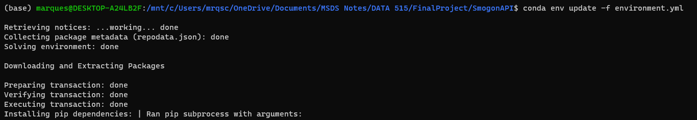
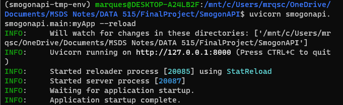
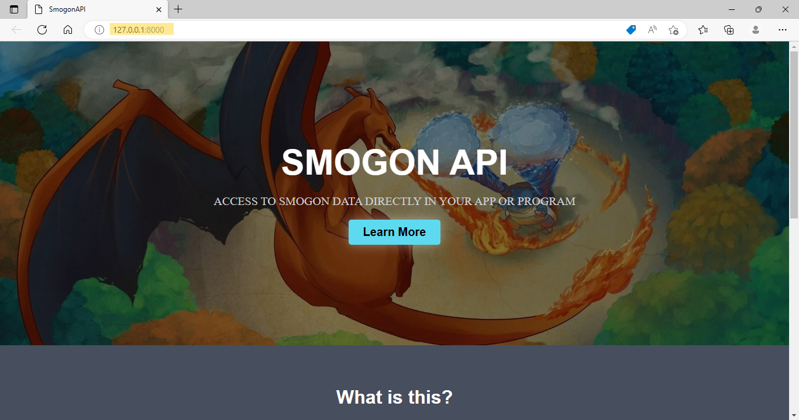
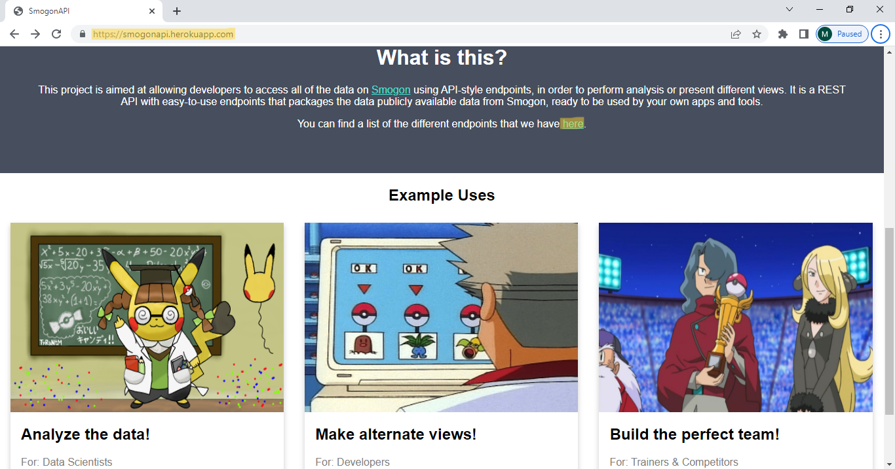
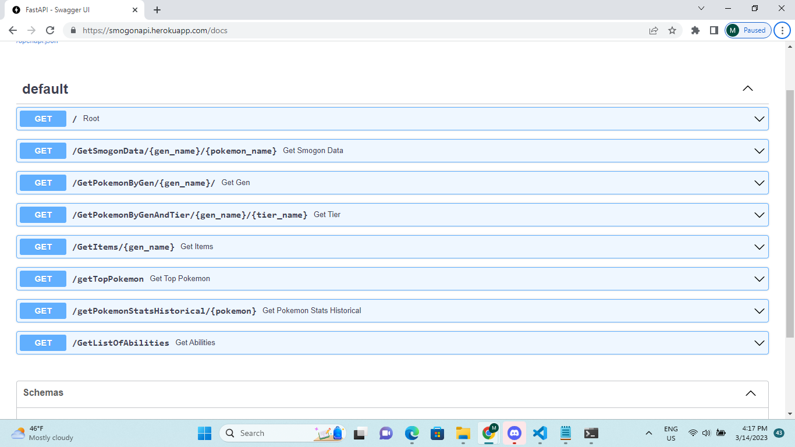

#  For Collaborators -- How to Run/Deploy Our Project
Our project can be started by downloading conda, and creating a virtual environment from the `environment.yml` file, located at the root of the repository. The command for this is `conda env create -f environment.yml`.

From there, make sure you have navigated to the top of the repository, and run the command `uvicorn smogonapi.smogonapi.main:myApp --reload`. This will load the API locally on your computer.

Note that this is running locally. To deploy this to Heroku, fork and clone the repository, make a Heroku account, and install the Heroku CLI (this may differ depending on OS).

Next, you will want to create a new Heroku app using `heroku create -a <app_name>`. You will need valid credentials and billing information. Finally, type `git push heroku main` to push to the heroku remote. You should be able access your app at "https://<app_name>.herokuapp.com". More information can be found on [Heroku](https://devcenter.heroku.com/articles/git)

# For Consumers -- How to Use Our API 
For developers who wish to use our API, they can go to <smogonapi.herokuapp.com/>. From there, they can click the embedded link to our endpoints, which allow different user inputs for retreiving specific JSON data about different pokemon stats, which they may use for their own subsequent projects.

